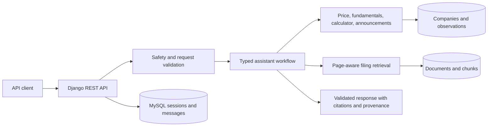

# FinSight AI

FinSight is a factual stock-market research and explanation service. It grounds filing answers in page-located passages, retrieves structured market/fundamental observations, and routes calculations through deterministic Decimal-based tools. It does not provide investment advice or price predictions.

## Current scope

The repository contains a Django REST API and relational data models. It supports company search, market observations, announcements, documents/passages, authenticated chat sessions, a deterministic portfolio analyzer, and an assistant workflow. A small browser workspace is served by Django; it is not a React application. PDF ingestion stores extracted page-aware chunks in the relational database. Retrieval uses bounded keyword search by default, with an optional FAISS/Sentence Transformers index builder; no vector index is shipped or verified. The workspace has no real issuer corpus and no measured latency/cost report.



## Local setup

Requires Python 3.12+ and MySQL 8.4. For local development without MySQL, explicitly set `USE_MYSQL=false` to use SQLite.

```powershell
cd backend
python -m venv .venv
.\.venv\Scripts\Activate.ps1
pip install -r requirements.txt
Copy-Item .env.example .env
# Edit .env and set DJANGO_SECRET_KEY, DB credentials, and optional LLM_API_KEY.
python manage.py migrate
python manage.py createsuperuser
python manage.py seed_demo_data  # optional: synthetic demo records only
python manage.py runserver
```

Health: `GET http://127.0.0.1:8000/api/v1/health`.

The browser research workspace is served at `http://127.0.0.1:8000/`. After signing in, search for `FINSIGHTDEMO` if the optional synthetic fixture has been seeded; it is not a real issuer. For local testing, Django Basic Authentication is used by the browser UI. Production should terminate TLS and use an appropriate session or identity provider.

## Docker Compose

### Run the production container locally

Copy `backend/.env.example` to `backend/.env` and set a unique Django secret, strong distinct database passwords, and `USE_MYSQL=true`. Add the public hostname to `DJANGO_ALLOWED_HOSTS`, including only hostnames served by this deployment. Run:

```powershell
docker compose up --build -d
docker compose logs -f api
```

The API container collects static assets, applies migrations, and serves Django through Gunicorn. MySQL data is stored in the named `mysql_data` volume. Set `APP_PORT` to change the published HTTP port. Put a managed HTTPS reverse proxy or hosting platform in front of the app; it must forward `Host` and `X-Forwarded-Proto: https`. Set `CSRF_TRUSTED_ORIGINS` to the site's HTTPS origin. Keep `.env` out of source control and use the hosting provider's secret manager in production. Configure database backups, restore procedures, monitoring, and a least-privilege database account before accepting real users.

### Deploy to a website host

The `backend` directory contains the Docker build context. A container host that supports Docker can build `backend/Dockerfile`, expose port `8000`, and provide the environment variables in `backend/.env.example`. Set `DJANGO_DEBUG=false`, a random `DJANGO_SECRET_KEY`, `DJANGO_ALLOWED_HOSTS` to the assigned domain, `CSRF_TRUSTED_ORIGINS=https://your-domain`, MySQL connection settings for a managed MySQL service, and `LLM_API_KEY` if assistant generation is enabled. Configure the host's public port and HTTPS certificate at its load balancer or ingress. Open `/` for the workspace and `/api/v1/health` for its health check.

Create an application user with a strong password using Django's user management (for example, `docker compose exec api python manage.py createsuperuser`) and use that account to sign in. The app does not include public sign-up, password reset, or an external identity provider. Keep admin and authenticated API routes behind HTTPS and an access-control plan.

No hosted domain or cloud account is configured in this repository, so these changes prepare a deployable container but do not publish the site to a public URL.

## API

- `POST /api/v1/assistant/ask`
- `GET /api/v1/companies?query=...`
- `GET /api/v1/companies/{id}/metrics`
- `GET /api/v1/companies/{id}/documents`
- `GET /api/v1/documents/{id}/passages`
- `GET /api/v1/announcements`
- `GET|POST /api/v1/sessions`
- `GET /api/v1/sessions/{id}/messages`
- `GET|POST /api/v1/watchlists`
- `POST /api/v1/portfolio/analyze`
- `GET /api/v1/funds`

Assistant requests, sessions, watchlists, and portfolio uploads require Django authentication. Ownership is derived from the authenticated account, not a caller-supplied ID header. Create accounts with Django admin or `python manage.py createsuperuser`; public registration is not implemented. Use HTTPS and secure cookies when deployed.

## Filing ingestion

Register a company first, then ingest a public, permitted PDF with its canonical source URL and period:

```powershell
python manage.py ingest_pdf .\data\annual-report.pdf --company-id 1 --title "Annual Report" --period FY25 --source-url https://issuer.example/report.pdf --source-name "Issuer filings" --license-terms "Reviewed public issuer filing terms"
```

Only text-extractable PDFs are supported; scanned PDFs require OCR. The importer enforces a 50 MiB size limit, uses a content checksum for repeat imports, and retains page numbers. Source licensing and terms must be reviewed and documented by the operator before ingestion.

Semantic retrieval is an optional install because FAISS wheels vary by platform. On a supported Linux environment, install `pip install -r requirements-rag.txt`, ingest documents, then run `python manage.py build_vector_index`. The FAISS index stores normalized sentence-transformer embeddings plus a corpus checksum and chunk-ID map under `VECTOR_INDEX_PATH`. Queries fall back to keyword search when no compatible index is present; tool output identifies the retrieval mode.

## Evaluation

Run `python manage.py run_evaluation` from `backend`. The versioned 22-case set includes six filing retrieval cases, four reported metric cases, four deterministic calculation cases, three price/announcement cases, and five advice refusals. It seeds an unmistakably synthetic demo issuer with a synthetic report, metrics, prices, and announcement, then checks tool traces, known values, a citation page, response shape, and refusal labels. Each run writes a JSON report under `evaluations/reports/`.

The evaluation suite validates software behavior against synthetic fixtures only; its scores are not evidence of accuracy on real company data. Real numeric accuracy, issuer-filing citation support, and retrieval quality still need a permitted corpus and manually verified expected facts/pages. No performance, cost, or production availability SLA has been measured.

## Data sources and limitations

The code references NSE/BSE, AMFI, issuer filings, and exchange observations as intended source classes; the repository does not bundle or fetch a production dataset. Populate records only from public or synthetic data and record source URL, access date, license/terms, attribution, and refresh cadence. The funds endpoint reports unavailable until verified AMFI data is configured. Historical observations are not live quotes. No live demo URL is deployed.

## Safety and known gaps

Advice/prediction refusal, prompt injection checks, Decimal calculator formulas, typed response contracts, authenticated session persistence, a basic browser research screen, and an optional semantic indexing workflow are implemented. Before claiming completion against the full hackathon submission checklist, still add a verified public filing corpus, build and validate its vector index, score real-corpus numeric/citation accuracy, measure latency/cost, broaden adversarial coverage, and deploy a live URL. The current 22/22 evaluation uses synthetic fixtures only.
